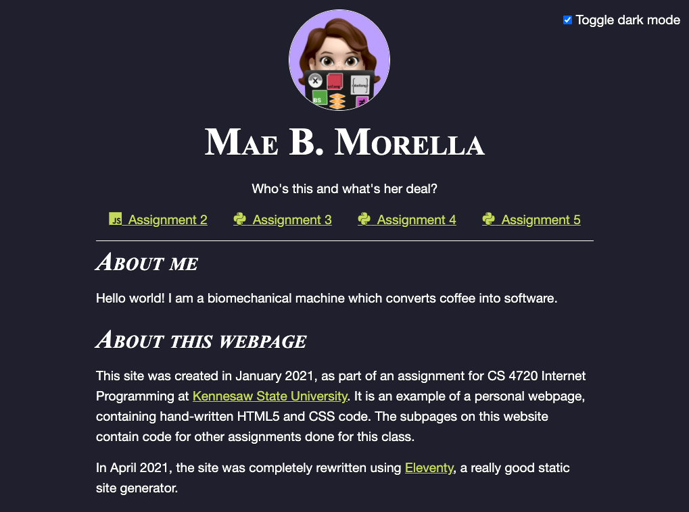

# internet-programming

A website created for CS 4720 - Internet Programming at Kennesaw State University.

[](https://morellam-dev.github.io/internet-programming/)

This is a static site, which is hosted [here on GitHub Pages]([https://morellam-dev.github.io/cs-4720-internet-programming/](https://morellam-dev.github.io/internet-programming/).
## Local development

Run the following commands for a live server.

```bash
$ npm install --include=dev
$ npm run serve
```

## Disclaimer

This repository contains solutions to school-assigned homework and lab assignments, and should be used only for reference and educational purposes by ***persons who are not currently enrolled students of Kennesaw State University or taking a similar class.*** Plagiarism or uncredited copying of this code is in violation of university policy, and is harshly discouraged.

***Under no circumstances should any of these files be copied or submitted as your own work.***

## License

MIT © 2021 Mae Morella
