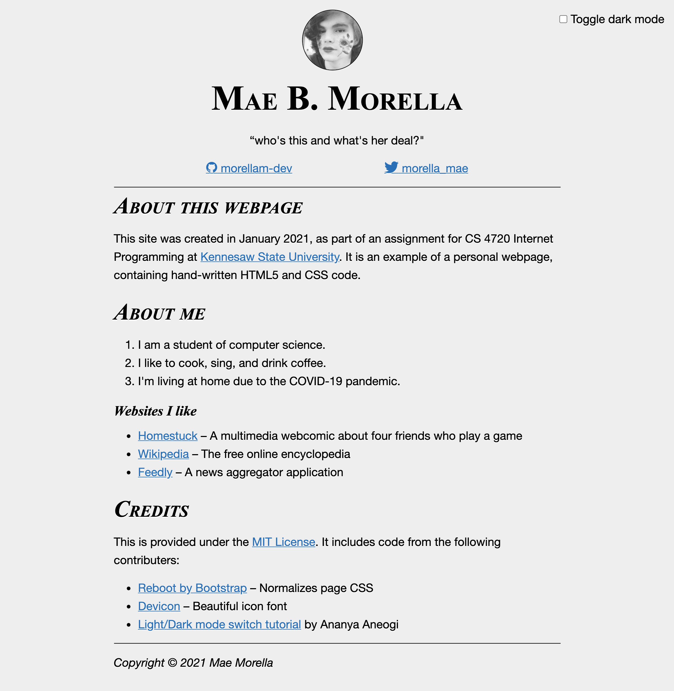
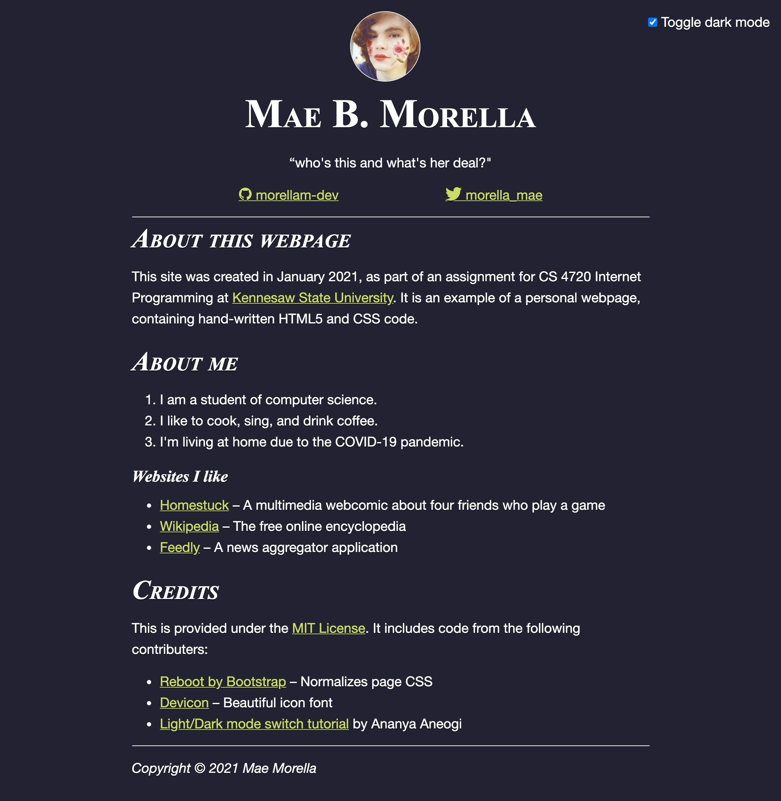
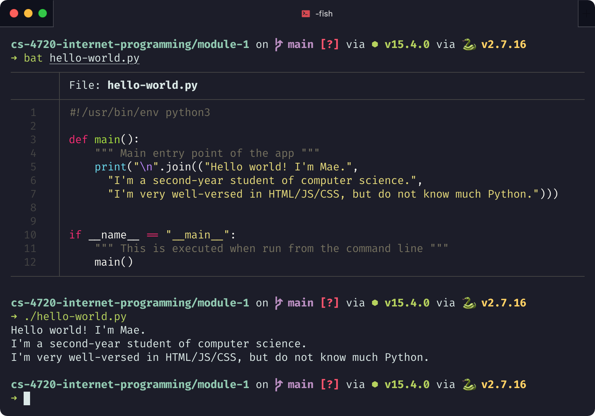

# Assignment 1 (Mae Morella)

### Write-up

For this assignment I aimed to create a minimalist but stylish webpage which showed off my pre-existing web design skills.

The result is a simple page listing of some general information about me. The content is nothing inspired.

The most complex part was the inclusion of a dark mode. Dark modes have become all the rage in web design recently, so I used [CSS custom properties](https://developer.mozilla.org/en-US/docs/Web/CSS/CSS_Variables) to make the page's color scheme change dynamically.

The design for the light mode was inspired by the papery, serify typography of [GitHub Flavored Markdown](https://github.github.com/gfm/). The dark mode uses colors from [Monokai Pro](https://monokai.pro/), a popular color scheme for IDE's and terminals. You might see the resemblence with my terminal, pictured below.

In the light theme, my profile image uses a [CSS filter](https://developer.mozilla.org/en-US/docs/Web/CSS/filter) to dynamically add or remove the grayscale effect.

The page is currently available [on GitHub pages](https://morellam-dev.github.io/cs-4720-internet-programming/module-1/index.html). It may become available at [KSU StudentWeb](https://studentweb.kennesaw.edu/~mmorella/), but my attempt to host it currently results in a 403 forbidden error.


### Screenshots







### Source code

#### index.html

```html
<!DOCTYPE html>
<html lang="en">

<head>
  <meta charset="utf-8">
  <title>MM | About Me</title>
  <meta name="description" content="">
  <meta name="author" content="Mae Morella">
  <!-- Reboot.css -->
  <link rel="stylesheet" href="https://cdn.jsdelivr.net/npm/bootstrap-reboot@4.5.4/dist/reboot.min.css">
  <!-- -->
  <link rel="stylesheet" href="styles.css">
  <!-- Devicon CDN -->
  <link rel="stylesheet" href="https://cdn.jsdelivr.net/gh/devicons/devicon@v2.8.2/devicon.min.css">
</head>

<body>
  <label id="theme-switch" class="theme-switch" for="checkbox_theme">
    <input type="checkbox" id="checkbox_theme"> Toggle dark mode
  </label>
  <header class="header">
    
    <div>
      <h1>Mae B. Morella</h1>
      <p class="lead">“who's this and what's her deal?"</p>
    </div>
    <ul class="nav-links list-unstyled">
      <li><a href="https://github.com/morellam-dev"><i class="devicon-github-original" title="GitHub"></i> morellam-dev</a></li>
      <li><a href="https://twitter.com/morella_mae"><i class="devicon-twitter-original" title="Twitter"></i> morella_mae</a></li>
    </ul>
  </header>
  <section>
    <h2>About this webpage</h2>
    <p>This site was created in January 2021, as part of an assignment for CS 4720 Internet Programming at <a href="https://www.kennesaw.edu/">Kennesaw State University</a>. It is an example of a personal webpage, containing hand-written HTML5 and CSS code.</p>
    <h2>About me</h2>
    <ol>
      <li>I am a student of computer science.</li>
      <li>I like to cook, sing, and drink coffee.</li>
      <li>I'm living at home due to the COVID-19 pandemic.</li>
    </ol>
    <h3>Websites I like</h3>
    <ul>
      <li><a href="https://www.homestuck.com/">Homestuck</a> – A multimedia webcomic about four friends
        who play a game</li>
      <li><a href="https://www.wikipedia.org/">Wikipedia</a> – The free online encyclopedia</li>
      <li><a href="https://feedly.com">Feedly</a> – A news aggregator application</li>
    </ul>
  </section>
  <section>
    <h2>Credits</h2>
    <p>This is provided under the <a
        href="https://github.com/morellam-dev/cs-4720-internet-programming/blob/main/LICENSE">MIT License</a>. It
      includes code from the following contributers:</p>
    <ul>
      <li><a href="https://getbootstrap.com/docs/5.0/content/reboot/">Reboot by Bootstrap</a>
        – Normalizes page CSS</li>
      <li><a href="https://devicon.dev/">Devicon</a> – Beautiful icon font</li>
      <li><a href="https://dev.to/ananyaneogi/create-a-dark-light-mode-switch-with-css-variables-34l8">Light/Dark mode
          switch tutorial</a> by <a href="https://ananyaneogi.com/"></a>Ananya Aneogi</a></li>
    </ul>
  </section>
  <footer class="footer">
    <p>Copyright © 2021 Mae Morella</p>
  </footer>
  <script src="dark.js"></script>

</body>

</html>
```

#### styles.css

```css
/* styles.css - by Mae Morella */

/* Layout */

body {
  max-width: 40em;
  margin: 0 auto;
  padding: 1rem;
}

/* Colors and dark theme */

:root {
  --font-color: #000;
  --font-shadow-color: #fff;
  --link-color: #2a70b6;
  --link-highlight-color: #0f325f;
  --bg-color: #eee;
}

[data-theme="dark"] {
  --font-color: #fff;
  --font-shadow-color: #111;
  --link-color: #cd6;
  --link-highlight-color: #ef8;
  --link-white-color: #c1bfbd;
  --bg-color: #223;
}

body {
  color: var(--font-color);
  background: var(--bg-color);
  transition: 0.25s color, 0.25s background, 0.25s text-shadow;
  font: 1.2rem/1.6 "Helvetica Neue", Helvetica, Arial, sans-serif;
  text-shadow: var(--font-shadow-color) 0px 1px;
}

/* Links */

a {
  color: var(--link-color);
  text-decoration: underline;
}
a:hover {
  color: var(--link-highlight-color);
}


/* Headings */

h1, h2, h3, h4, h5 {
  font-family: 'Times New Roman', Times, serif;
  font-style: italic;
}

h1 {
  font-size: 3em;
    font-variant: small-caps;
  font-style: normal;
}

h2 {
  font-size: 2em;
  font-variant: small-caps;
}

h3 {
  font-size: 1.2em;
}

/* Header */

.header {
  text-align: center;
  border-bottom: 1px solid;
}

.footer {
  border-top: 1px solid;
  padding-top: 1rem;
  font-style: italic;
}

.profile-pic {
  border-radius: 100%;
  border: 1px solid;
  margin: 0 auto;
  margin-right: 1rem;
  filter: grayscale(1);
}

[data-theme="dark"] .profile-pic {
  transition: 0.25s filter;
  filter: grayscale(0);
}


.nav-links {
  display: flex;
  justify-content: space-evenly;
}

.list-unstyled {
  list-style: none;
  margin-left: 0;
  padding-left: 0;
}

/* Dark theme toggle */

@media only screen and (min-width: 30rem) {
  .theme-switch {
    position: fixed;
    right: 1rem;
  }
}
```

#### hello-world.py

```py
#!/usr/bin/env python3

def main():
    """ Main entry point of the app """
    print("\n".join(("Hello world! I'm Mae.",
      "I'm a second-year student of computer science.",
      "I'm very well-versed in HTML/JS/CSS, but do not know much Python.")))


if __name__ == "__main__":
    """ This is executed when run from the command line """
    main()

```
