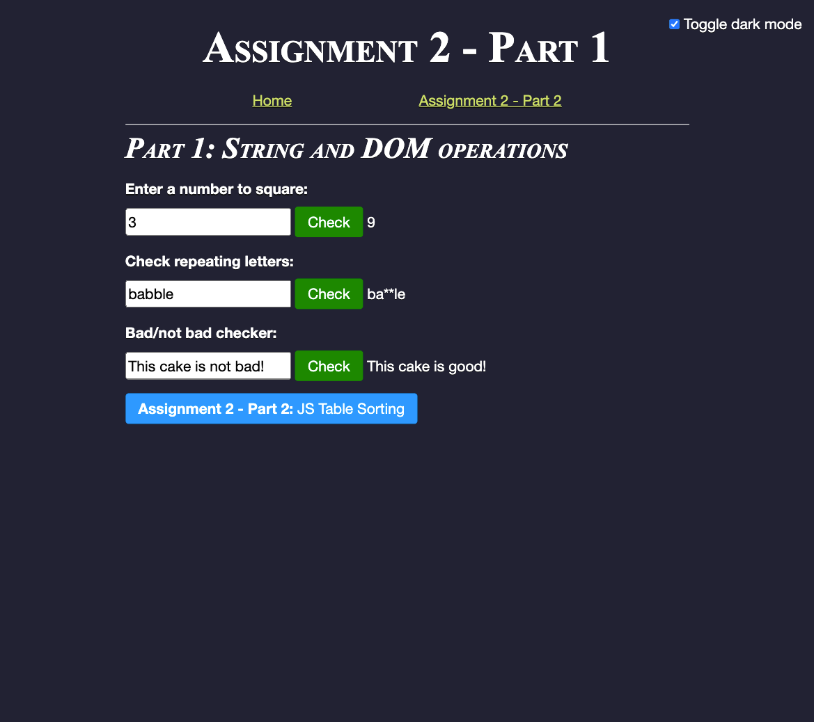
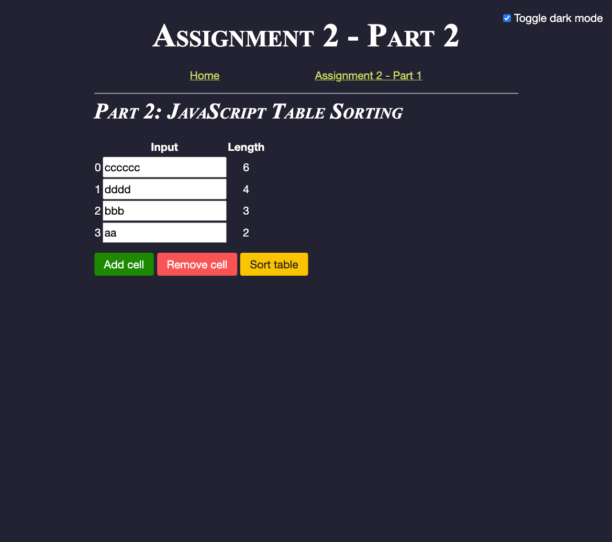

# Assignment 2 Response

CS 4720 - Internet Programming

Mae Morella (mmorella@students.kennesaw.edu)

February 10, 2021

## Screenshots

Live demo at [studentweb.kennesaw.edu/~mmorella/module-2/](http://studentweb.kennesaw.edu/~mmorella/module-2/).





## Source Code

### HTML/CSS Documents

```html
<!-- assignment 2 index.html -->
<!DOCTYPE html>
<html lang="en">

<head>
  <meta charset="utf-8">
  <title>MM | Assignment 2 - Part 1</title>
  <meta name="description" content="">
  <meta name="author" content="Mae Morella">
  <!-- Reboot.css -->
  <link rel="stylesheet" href="https://cdn.jsdelivr.net/npm/bootstrap-reboot@4.5.4/dist/reboot.min.css">
  <!-- Module 1 stylesheet -->
  <link rel="stylesheet" href="../module-1/styles.css">
  <!--  -->
  <link rel="stylesheet" href="assignment2.css">
</head>

<body>
  <label id="theme-switch" class="theme-switch" for="checkbox_theme">
    <input type="checkbox" id="checkbox_theme"> Toggle dark mode
  </label>
  <header class="header">
    <h1>Assignment 2 - Part 1</h1>
    <ul class="nav-links list-unstyled">
      <li><a href="../module-1/">Home</a></li>
      <li><a href="part2.html">Assignment 2 - Part 2</a></li>
    </ul>
    <p class="lead">
  </header>
  <h2>Part 1: String and DOM operations</h2>
  <form id="assignment2-demo">
    <p>
      <label for="squareNumberInput">Enter a number to square:</label>
      <input id="squareNumberInput" type="number">
      <button type="button" class="button button-submit"
      onclick="handleStringOperation('squareNumberInput', squareNumber)">
      Check</button>
      <output for="squareNumberInput"></output>
    </p>
    <p>
      <label>Check repeating letters:<br></label>
      <input id="fixStartInput" type="text" list="fixStartList">
      <button type="button" class="button button-submit"
      onclick="handleStringOperation('fixStartInput', fixStart)">Check</button>
      <output for="fixStartInput"></output>
      <datalist id="fixStartList">
        <option value="babble"></option>
        <option value="caca"></option>
        <option value="\[^x]\<script>alert('XSS!');"></option>
      </datalist>
    </p>
    <p>
      <label>Bad/not bad checker:</label>
      <input id="notBadInput" type="text" list="notBadList">
      <button type="button" class="button button-submit"
      onclick="handleStringOperation('notBadInput', notBad)">Check</button>
      <output for="notBadInput"></output>
        <datalist id="notBadList">
          <option value="This not bad cake is okay.">
          <option value="This cake is not bad!">
          <option value="This movie is not quite so bad!">
        </datalist>
    </p>
  </form>
  <script src="part1.js"></script>
  <p><a href="part2.html" class="button button-info">
    <strong>Assignment 2 - Part 2:</strong> JS Table Sorting</a></p>
  <script src="../module-1/dark.js"></script>
</body>

</html>
```

```html
<!-- part2.html -->
<!DOCTYPE html>
<html lang="en">

<head>
  <meta charset="utf-8">
  <title>MM | Assignment 2 - Part 2</title>
  <meta name="description" content="">
  <meta name="author" content="Mae Morella">
  <!-- Reboot.css -->
  <link rel="stylesheet"
  href="https://cdn.jsdelivr.net/npm/bootstrap-reboot@4.5.4/dist/reboot.min.css">
  <!-- Module 1 stylesheet -->
  <link rel="stylesheet" href="../module-1/styles.css">
  <!--  -->
  <link rel="stylesheet" href="assignment2.css">
</head>

<body>
    <label id="theme-switch" class="theme-switch" for="checkbox_theme">
      <input type="checkbox" id="checkbox_theme"> Toggle dark mode
    </label>
  <header class="header">
    <h1>Assignment 2 - Part 2</h1>
    <ul class="nav-links list-unstyled">
      <li><a href="../module-1/">Home</a></li>
      <li><a href="./">Assignment 2 - Part 1</a></li>
    </ul>
    <p class="lead">
  </header>
  <h2>Part 2: JavaScript Table Sorting</h2>
  <form id="assignment2-demo">
    <p>
    <table class="sorted-table" id="sort-table">
      <thead>
        <th></th><th>Input</th><th>Length</th>
      </tr>
      </thead>
      <tbody data-class="sort-table">
      </tbody>
    </table>
    </p>
    <p>
      <button type="button" class="button button-submit"
      onclick="handleAddCell()">Add cell</button>
      <button type="button" class="button button-remove"
      onclick="handleRemoveCell()">Remove cell</button>
      <button type="button" class="button button-sort"

      onclick="handleSortTable()">Sort table</button>
    </p>
  </form>
  <script src="part2.js"></script>
  <script src="../module-1/dark.js"></script>
</body>

</html>
```

```css
/* assignment2.css */

form label {
  font-weight: bold;
  display: block;
}

.button {
  display: inline-block;
  color: var(--color, #000);
  background: var(--background, #fff);
  border: 1px solid var(--background, #fff) !important;
  border-radius: 0.25rem;
  padding: 0.25rem 1rem;
  height: 100%;
  transition: 0.5s background;
  text-decoration: none !important;
  text-shadow: none;
}

.button:hover {
  background: var(--background-hover, #f8f8f8);
  color: var(--color, #000);
}

.button-submit {
  --color: white;
  --background: #080;
  --background-hover: #060;
}

.button-info {
  --color: white;
  --background: #09f;
  --background-hover: #07d;
}

.button-remove {
  --color: white;
  --background: #f55;
  --background-hover: #bb3e3e;
}

.button-sort {
  --color: #222;
  --background: #ffc400;
  --background-hover: #b98800;
}

.sorted-table th,
.sorted-table td {
  text-align: center;
}

.hide {
  display: none !important;
}
```

### JavaScript

```js
// part1.js
// STRING PROGRAMS

/**
* Verbosely squares a number.
* As a side effect, logs "The square of N is N^2."
* @param {Number} n a number to square.
* @returns {Number} the square of n.
*/
const squareNumber = (n) => {
  const square = Math.pow(n, 2);
  console.log(`The square of ${n} is ${square}.`);
  return square;
}

/**
* @param {String} str A string with at least one character.
* @returns {String} the input string, but all succeeding occurrences of
* its first character have been replaced with '*'
*/
const fixStart = (str) => {
  const  first = str.charAt(0);
  return first + str.slice(1).replaceAll(first, '*');
}


/**
* Finds the first appearance of the substring 'not' and 'bad'.
* If the 'bad' follows the 'not', then it should
* replace the whole 'not'...'bad'
* @params {String} str
* @returns {String}
*/
const notBad = (str) => str.replace(/not.*bad/g, "good");


// EVENT HANDLER

/**
 * Execute a function using the `value` attribute of `<input id="elementId">`.
 * The result is stored in `<output for="elementId">`
 * @param {String} elementId The ID of an input element
 * @param {(val: String) => String} func The function to execute
 */
const handleStringOperation = (elementId, func) => {
  const inputEl = document.getElementById(elementId);
  const outputEl = document.querySelector(`output[for=${elementId}]`);
  if (inputEl.value && outputEl) {
    outputEl.innerText = func(inputEl.value);
  }
}
```

```js
// EVENT HANDLERS FOR ASSIGNMENT 2 PART 2

const tableEl = document.querySelector("[data-class~=sort-table]");

// Updates the length value
const handleCellInput = (el) => {
  const length = el.value.length;
  const lengthEl = el.closest("[data-class~=row]")
    .querySelector("[data-class~=length]");
  lengthEl.innerText = length;
}

// Create a new cell, or unhide the most recently hidden one
const handleAddCell = () => {
  let hiddenRows = tableEl.querySelectorAll("[data-class~=row].hide");
  let visibleRows = tableEl.querySelectorAll("[data-class~=row]:not(.hide)");
  // if there is a hidden row,
  if (hiddenRows.length > 0) {
    // unhide the recently hidden row cell
    hiddenRows[0].classList.remove("hide");
  } else {
    // create a new row element.
    let index = visibleRows.length;
    let template = document.createElement('template');
    template.innerHTML = `<tr data-class="row">
    <td data-class="index">${index}</td>
    <td>
      <input data-class="input" type="text" oninput="handleCellInput(this)">
    </td>
    <td><output data-class="length">0</output></td></tr>`
      .trim();
    let newRow = template.content.firstChild;
    tableEl.appendChild(newRow);
  }
}

// Hide the last row
const handleRemoveCell = () => {
  let rows = tableEl.querySelectorAll("[data-class~=row]:not(.hide)");
  if (rows.length > 1)
    rows[rows.length - 1].classList.add("hide");
}

// Reorder the table by string length
const handleSortTable = () => {
  const inputs = tableEl
    .querySelectorAll("[data-class~=row]:not(.hide) [data-class~=input]");
  let strings = [...inputs].map(el => el.value);
  strings = strings.sort((a, b) => b.length - a.length);
  inputs.forEach((el, i) => {
    el.value = strings[i];
    handleCellInput(el);
  });
}
// When the page loads, create one empty row.
if (tableEl) {
  handleAddCell();
}
```

The source code also utilizes some files (`../module-1/styles.css` and `..module-1/dark.js`) which were created in the previous module and are left unmodified. These files can be viewed at [github.com/morellam-dev/cs-4720-internet-programming/tree/main/module-1](https://github.com/morellam-dev/cs-4720-internet-programming/tree/main/module-1).
