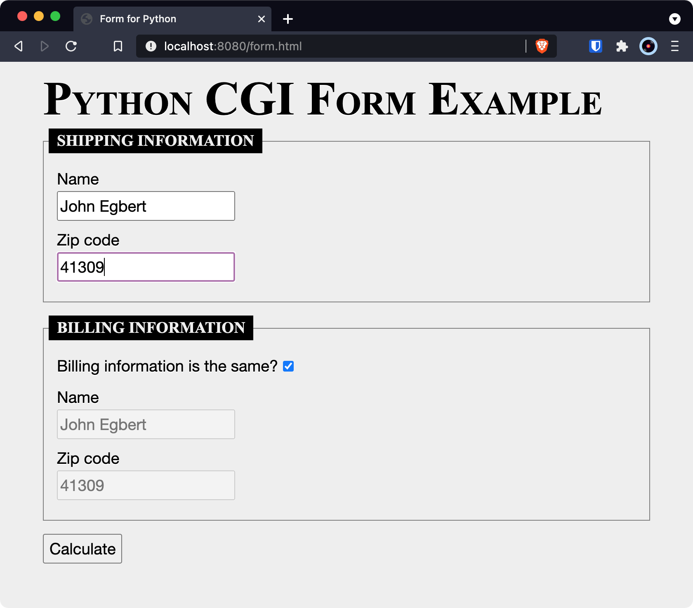
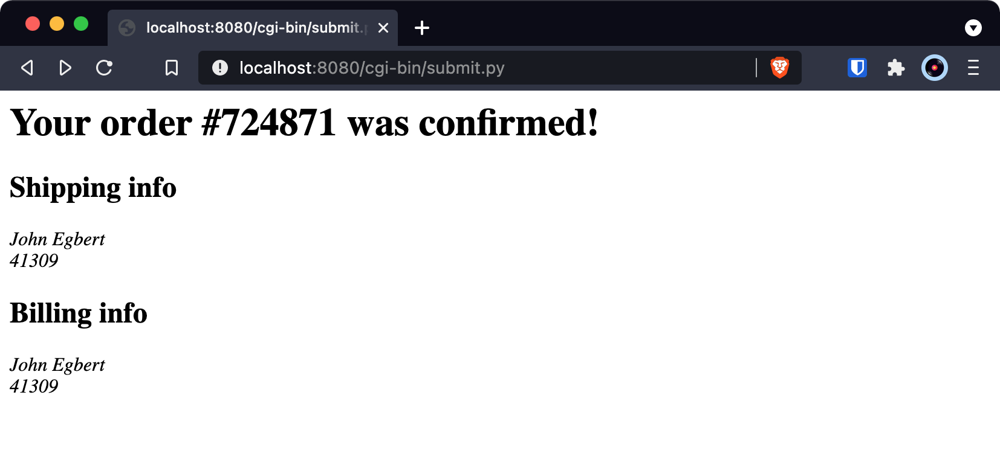
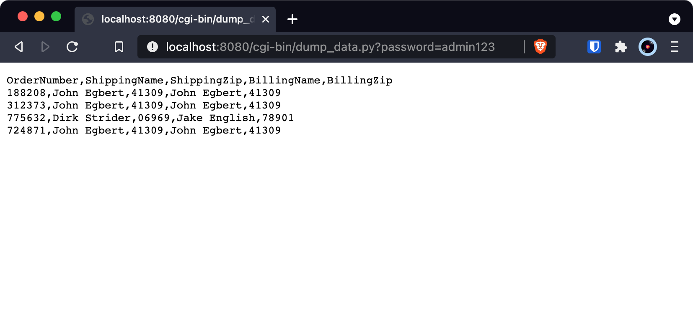

### htdocs/form.html



````html

````

<style>
img {
  display: block;
  max-width: 80%;
  margin: 0 auto;
}
</style>

### htdocs/cgi-bin/submit.py



````py

````
### htdocs/cgi-bin/dump_data.py




````py

````
